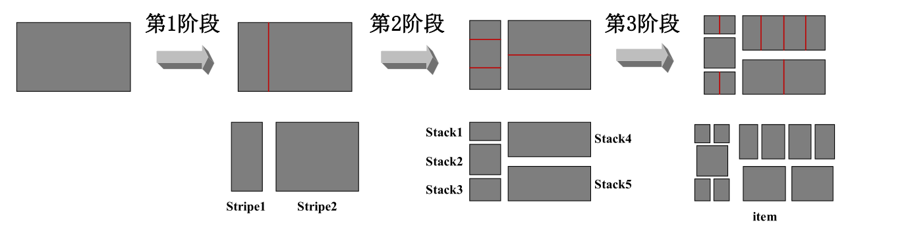
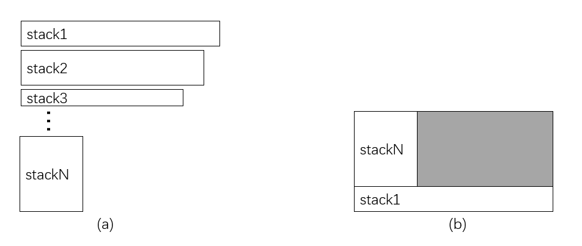
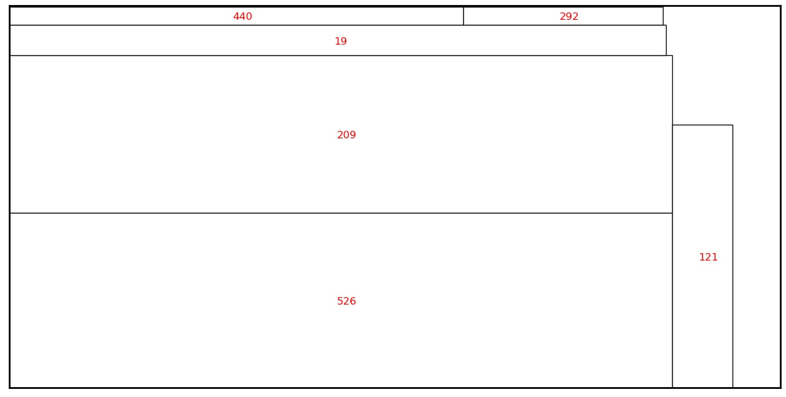

# 2022年10研究生数学建模竞赛

## 项目介绍

[“中国光谷·华为杯”第十九届中国研究生数学建模竞赛](https://cpipc.acge.org.cn//cw/detail/4/2c90801583651d4101838850aace3087)包括A、B、C、D、E、F共6道赛题，其中A题和B题为华为赛题，我们此次建模选择B题。B题是**方形件组合优化问题**，任务可以概述为寻找切割方案使板材利用率最高，详情请见官网赛题。我们根据先验信息将问题划分为几个阶段，然后使用线性探测、遗传算法、局部窗口等方法求解，在问题一上获得了90%+的利用率，问题二上获得了60%+的利用率。

## 项目结构

```python
ROOT_DIR/
|-- data/
|   |-- A/
|   |   |-- dataA1.csv
|   |   |-- dataA2.csv
|   |-- B/
|-- outputs/
|
|-- solutionA/
|   |-- processes.py
|   |-- optimization.py
|   |-- utils.py
|   |-- main_lp.py  # 函数入口，采用linear probe方法
|   |-- main_ga.py  # 函数入口，采用genetic algorithm
|
|-- solutionA/
|   |-- processes.py
|   |-- optimization.py
|   |-- utils.py
|   |-- main_lp.py  # 函数入口，采用linear probe方法
|   |-- main_ga.py  # 函数入口，采用genetic algorithm
|
|-- .gitignore
|-- README
```

我们将A题与B题求解过程放在两个文件夹里，`processes.py` 文件包括产品项拼成栈实现、栈拼成条带实现、条带拼成板实现，`optimization.py` 文件包括遗传算法相关代码实现，main.py实现数据到利用率和排版方式的端到端的输出。

## 解题思路

### 第一问

第一题是排版优化问题，在满足三阶段分隔约束下，求解排版方案使得原板利用率最高。题目的难点在于**如何保证三阶段约束**。三阶段切割示意图如下：竖着切割将板分为多个条带，横着切割将条带分为多个栈，竖着切割将栈分为多个产品项。上述过程中切割方向也可以横竖横。



将上图的切割方案逆过来，就得到了我们的三阶段排版方案：将产品项左右方向拼成栈、栈上下方向拼成条、条左右方向拼成板。这种拼板方式可以保证三刀能分隔出所有的产品项。原板总利用率优化问题转换成三阶段利用率优化问题子问题。

1. 第一阶段：产品项拼成栈

    由于数据中长或宽相同的产品项比较少，所以我们直接把长或者宽相同的产品项拼接在一起，因为栈是横着放的，所以需要保证拼成后栈的长度不超过2440。

2. 第二阶段：栈拼成条

    栈是竖着拼接成条的，需要保证条带中栈的宽度之和不超过1220，优化目标为最大化条带利用率。条带的面积为原板的宽1440*条带中最长的栈的长度。

    将栈根据长度进行排序，如下图(a)所示。同一条里的栈的长度应该相差不多，否则会造成下图(b)中阴影部分的浪费。为了避免这种浪费，并且加快求解速度，我们可以设置窗口，仅在当前窗口内选择栈组成条带。

    

3. 第三阶段：条拼成板

   条是左右拼接成板的，需要保证条长度之和不超过2440，优化目标为最大化板利用率。注意，这里的利用率是条面积和除以板面积，而最终计算的利用率是产品项面积和除以板面积。

   将条根据宽度随机排序，同样设置窗口，尽在窗口内选择条组成板，这里主要是为了加速。


### 第二问

第二问加入了批次的概念，新增约束如下：

- 批次内产品项数目不超过1000
- 批次内产品项总面积不超过250m^2
- 同一订单不可以同时存在于两个批次中
- 不同材质产品项不能在同一个原板上进行切割

我们可以先将订单分组成不同的批次，然后再针对每个批次进行排版。

组批过程也是有约束优化问题，优化目标为批次内原板利用率。但一个现实问题是**计算量太大了！**。批次内原板利用率也需要通过优化进行求解，用它作为优化目标指导组批过程的优化需要耗费大量的时间，受限于仅四天的建模时间，我们放弃这种方案。

此时需要寻找另一个指标，需要满足和利用率存在相关关系且计算速度快两个条件。两个订单中都包含某一种相同材质的产品项时，将这两个订单组批在一起，可以将相同材质的产品项一起排版，提高利用率。受此启发，我们给每个订单抽取一个特征向量，指示订单中各种材质的产品项的个数。统一批次内的订单之间需要具有最大的相似度，我们以此为优化目标优化组批过程，相似度定义为特征向量之间的余弦距离。

划分好批次后，在每个批次内，针对每种材质，分别进行第一问的排版优化即可。

## 快速开始

将数据集放置到`data`路径下，对于问题A，运行`python solutionA/main_lp.py`或者`python solutionA/main_ga.py`，对于问题B，运行`python solutionB/main_lp.py`或者`python solutionB/main_ga.py`，结果保存在`outputs`文件夹中。

下图展示了一个原板排版结果，其中红色数字表示产品项id。


## 致谢

第三晚熬到次日六点，第四晚更是直至上午十一点多过提交完论文才休息，最真诚的感谢致予我不间断工作的茶壶吧。